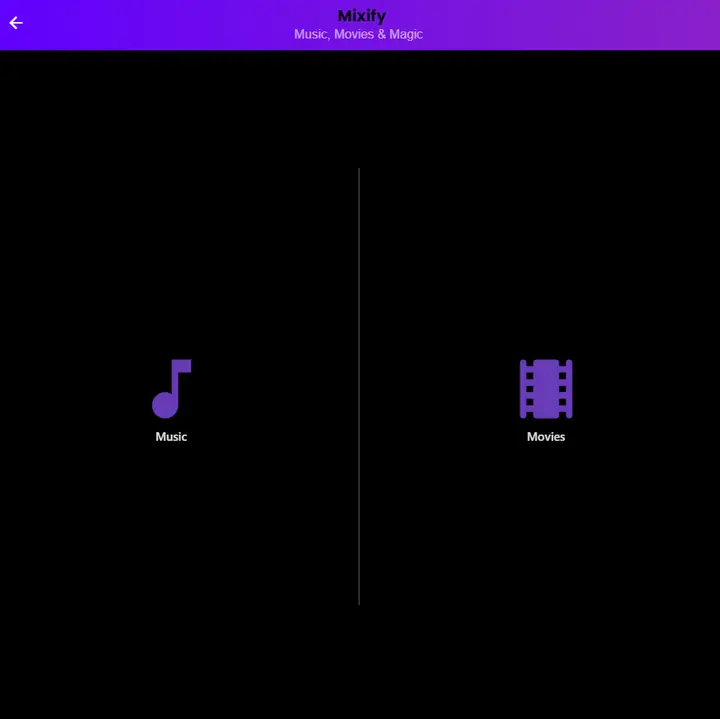
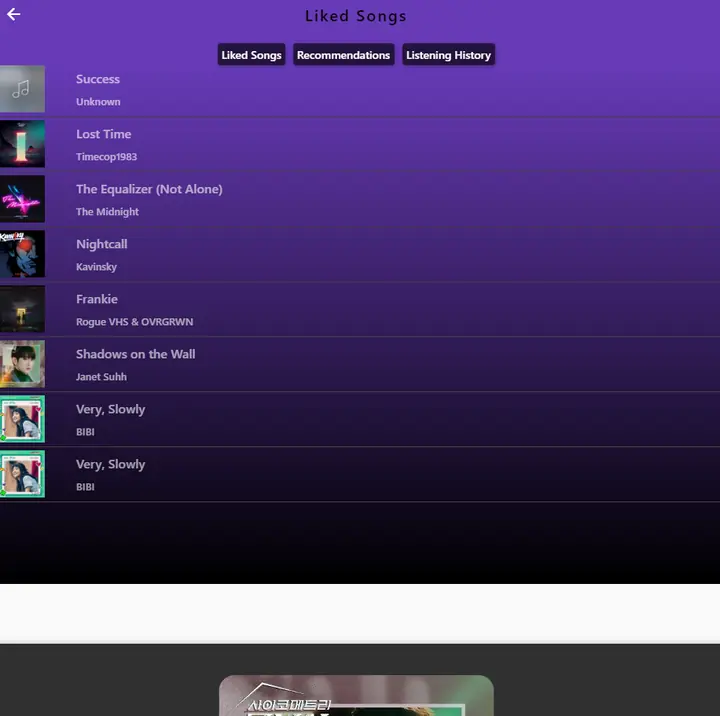
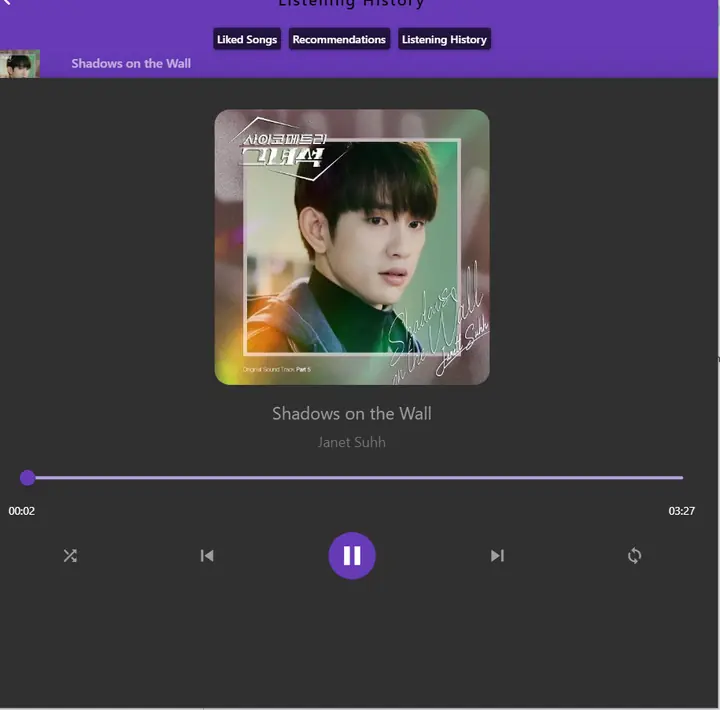
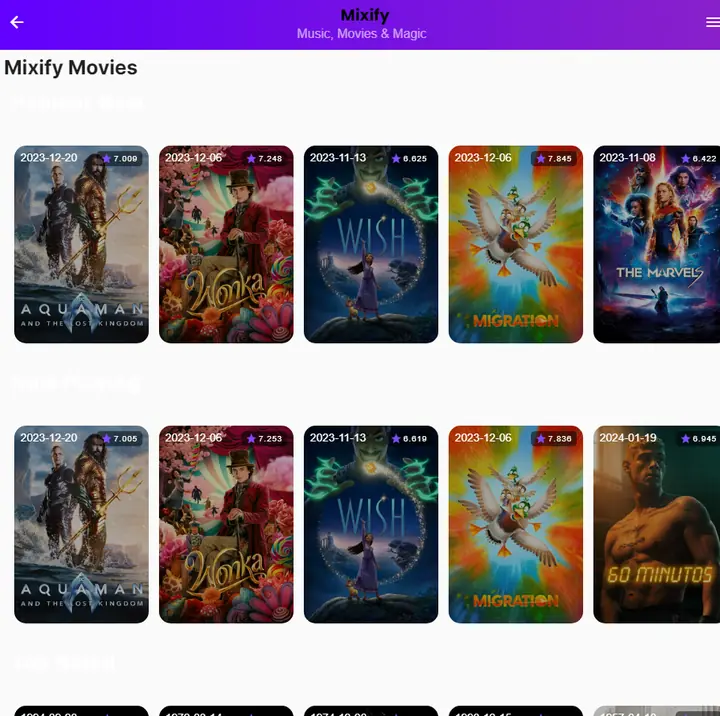
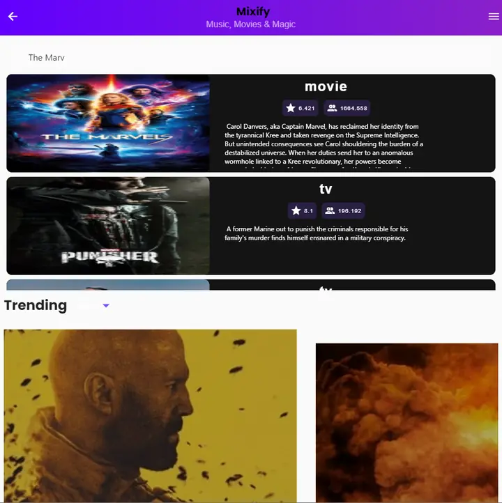
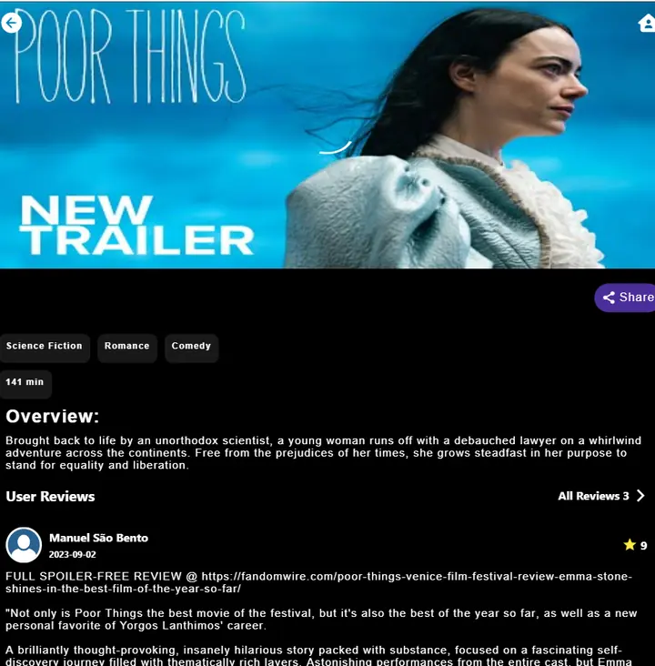
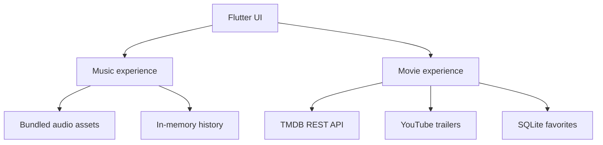

<div align="center">

# Mixify

### Music, Movies & Magic - together in one Flutter experience

Browse movies and TV series while keeping a local music player, favorites, and listening history close at hand.


</div>

## Overview

Mixify is a cross-platform Flutter course project that explores a unified entertainment interface. Its music side plays bundled audio with queue controls and session history; its movie side retrieves live catalog data from TMDB, supports search and genre discovery, presents detailed titles and reviews, and opens trailers through YouTube Player.

The current repository launches directly into the Mixify experience after a short splash screen. Firebase authentication was part of the original prototype shown in the course report, but it is disabled in the source currently committed here.

## App preview

| Choose an experience | Music library | Now playing |
| --- | --- | --- |
|  |  |  |

| Movie discovery | Search results | Movie details and trailer |
| --- | --- | --- |
|  |  |  |

## Features

### Music

- Local audio playback using bundled demo tracks
- Play, pause, seek, next, and previous controls
- Shuffle and loop modes
- Liked-song collection and listening history
- Sliding now-playing panel with cover art and progress

### Movies and television

- Popular, now-playing, top-rated, upcoming, and trending catalog sections
- Combined movie and TV search powered by TMDB
- Detail pages with overview, ratings, genres, reviews, and related titles
- YouTube trailer playback
- Share actions and local SQLite favorites

## Architecture



## Tech stack

| Area | Technology |
| --- | --- |
| Application | Flutter and Dart |
| Movie data | TMDB REST API and `http` |
| Video | `youtube_player_flutter` |
| Audio | `audioplayers` |
| Local persistence | SQLite, SharedPreferences |
| Interface | Material widgets, Google Fonts, Carousel Slider, Sliding Up Panel |
| Authentication prototype | Firebase Core and Firebase Auth dependencies |

## Project structure

```text
.
├── assets/                         # Demo music, artwork, and app icon
├── lib/
│   ├── api/                        # TMDB key configuration
│   ├── details/                    # Movie, TV, and song details
│   ├── models/                     # TMDB requests and favorites
│   ├── presentation/               # Music/movie screens and widgets
│   ├── sqlLiteLocalStorage/        # Favorite-title database helper
│   ├── home.dart                   # Music/movie selection screen
│   └── main.dart                   # App entry point
├── test/                           # Flutter widget test
└── pubspec.yaml
```

## Running locally

### Prerequisites

- Flutter stable with Dart 3.2.3 or newer
- An Android emulator, physical Android device, or supported desktop/web target
- A free [TMDB API key](https://developer.themoviedb.org/docs/getting-started)

### 1. Clone and install dependencies

```bash
git clone https://github.com/steezy-archv/Mixify-Movies-Melody_Flutter-App-.git
cd Mixify-Movies-Melody_Flutter-App-
flutter pub get
```

### 2. Run with your TMDB key

The application reads the key from a compile-time Dart definition; no API key needs to be committed.

```bash
flutter run --dart-define=TMDB_API_KEY=YOUR_TMDB_API_KEY
```

Choose a target explicitly when needed:

```bash
flutter devices
flutter run -d <device-id> --dart-define=TMDB_API_KEY=YOUR_TMDB_API_KEY
```

### 3. Run checks

```bash
flutter analyze
flutter test
```

## Current limitations

- Firebase initialization and authentication screens are not connected in the current source.
- The course report records video playback as functional on Android but unreliable on web.
- Music uses large bundled demonstration files rather than remote streaming.
- The interface was designed primarily around the project team's original test targets; other platforms may require layout or plugin adjustments.

## Team and contribution

Created for Software Development III at Ahsanullah University of Science & Technology by:

- **Ali Faruk Shihab** - music experience
- **Mainul Hasan Khan** - movie and television experience
- **Espa Shaheen Ohi** - authentication prototype and documentation

## Data and media notice

This product uses the TMDB API but is not endorsed or certified by TMDB. Movie metadata and imagery come from TMDB. Bundled music and artwork were included for classroom demonstration; their rights remain with their respective owners and they should be replaced with licensed assets before redistribution.

## Security note

An older TMDB key was previously committed to the repository. Removing it from the latest source does not erase it from Git history, so the exposed credential should be revoked and replaced in the TMDB account.
